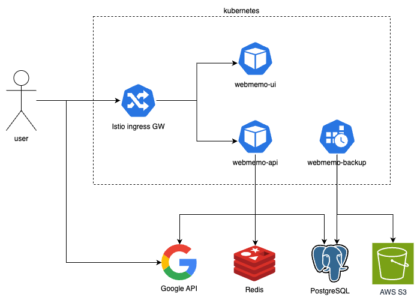

# WebMemo

WebMemo is a collaborative note-taking application that supports Markdown
editing with real-time preview. It features web publishing, tag-based
organization, interactive checkboxes, image embedding
(using [Imageer](https://github.com/isutare412/imageer)), and team collaboration
with approval workflows.

## Deployment Architecture

## Screenshots

### Memo Edit
Create and edit memos using a Markdown editor with Write/Preview tabs. Add tags
for organization, use the formatting toolbar for headings, lists, checkboxes,
and images.

### Memo View
View rendered memos with interactive checkboxes, embedded images.

### Collaboration
Publish your memos to the web and collaborate with others.

